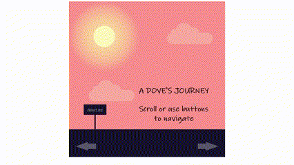

# A Dove's Journey

This is a project that showcases a parallax scrolling effect using HTML, CSS, and JavaScript. It tells a story about a dove's journey and incorporates various elements and transitions to create an immersive experience.

## Demo

## Getting Started

To get started with the project, follow these steps:

1. Clone the repository: `git clone <repository_url>`
2. Open the `index.html` file in a web browser.

## Project Structure

The project contains the following files and directories:

- `index.html`: The main HTML file that displays the webpage.
- `style.css`: The CSS file that defines the styles and layout of the webpage.
- `script.js`: The JavaScript file that adds functionality to the webpage.

## Usage

Once you have the project running, you can scroll or use the navigation buttons to navigate through the different sections of the webpage. The horizontal parallax scrolling effect creates a smooth transition between the sections. You can also click on the "About me" link to access additional information.

## Resources

The project uses the following resources:

- [Ink Free](fonts/Inkfree.ttf): A font used for the title.
- [Monotype Corsiva](fonts/Monotype%20Corsiva.ttf): A font used for the subtitles.
- [Gill Sans](fonts/Gill%20Sans.otf) and [Gill Sans Medium](fonts/Gill%20Sans%20Medium.otf): Fonts used for the paragraphs.
- [Smile](audio/smile.mp3): Royalty-free music by Benjamin Tissot.